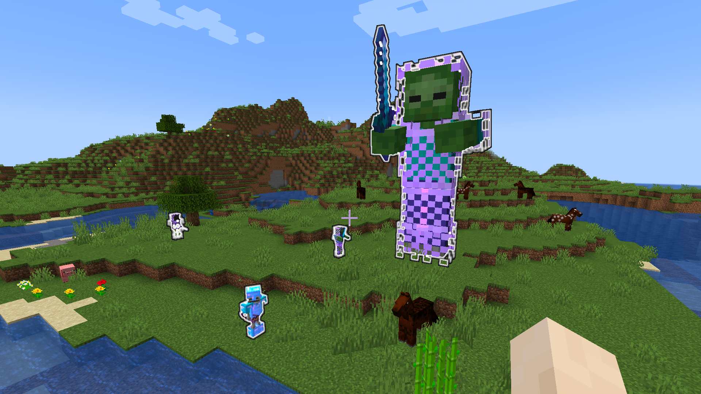

## Compatibility

Tested on Spigot-1.21.3.

## Introduction

A Minecraft (Bukkit) plugin that allows to fully customize cloths and tools, enhancements and effects, drop and attributes at entity spawn.

## Features

* Synergies perfectly with [TakeAim](https://github.com/uprial/takeaim) plugin
* 5% of animals naturally spawn with up to 400% health increase.
* 5% of hostile monsters spawn with an increased movement speed up to 100%.
* Once killed, a player respawns with an apple in hand and a small jump and movement bonus for a minute.
* 4% of zombie-like mobs spawn with a tiny jump and movement bonus, fire resistance, in GOLDEN equipment(*1) with random protection and random thorns, a slightly-enchanted golden axe (*1). Drops a gold ignot. (*3)
* 2% of zombie-like mobs spawn with a tiny jump and movement bonus, fire resistance, in IRON equipment(*1) with random protection and random durability, a well-enchanted sword (*1). Drops an iron block. (*3)
* 1% of skeleton-like mobs spawn with 5 minutes glowing aura, a medium jump and movement bonus, fire resistance and regeneration, in DIAMOND equipment(*1) with maybe top protection and random durability and random support enhancements, a top-enchanted bow (*2). Drops a diamond. (*3)
* 0.5% of zombie-like mobs spawn with 5 minutes glowing aura, a medium jump and movement bonus, fire resistance and regeneration, in CHAINMAIL equipment(*1) with maybe top protection and random durability and random support enhancements and top thorns, a top-enchanted sword (*2). Drops lapiz lazuli and redstone. (*3)
* 5% of Pillagers and Piglings have crossbows (*2) with maybe top piercing, random durability, random quick charge, multishot.
* 5% of Drowned have tridents (*2) with maybe top impaling, random durability, channeling.
* 5% of Horses have the best maximum health, improved movement speed and knockback resistance.
* 5% of Rabbits are the killer bunnies.
* 100% of Withers have thorns.
* 0.1% of creepers are a little more dangerous in most attributes.
* Each 5,000 damage dealt by the closest player increases probability of hard monsters spawn to 100%.
* 25% of Vexes are replaced to illusioners.
* 10% of Illusioners have a large jump and movement bonus, fire resistance and regeneration, in NETHERITE equipment(*1) with maybe top protection and thorns and random support enhancements, a top-enchanted bow (*2). May drop an enchanted golden apple, a netherite scrap, a book of mending, a totem of undying, and a diamond pickaxe. (*3)

(*1) The default drop chance is 8.5%, and each level of looting adds 1% to the drop chance.

(*2) "Maybe top" items have twice less default drop chance (4.25%), looting still adds 1% to the drop chance.

(*3) Each level of looting adds 1 to the max possible drop amount.

#### You can configure:
* A filter of types, spawn reasons and probabilities
* Entities' max health, effects, and equipment
* Templates of effects and enchantments
* Random distributions for the majority of numeric values
* Entities' following range
* Drop items and drop exp

#### You can solve the following problems:
* Increase the velocity of specific entities, thus make some enemies more dangerous naturally
* Equip entities to protect them from environmental influence
* Make items droppable to award a killer

## Commands

`customcreatures reload` - reload config from disk

## Permissions

* Access to 'reload' command:
`customcreatures.reload` (default: op)

## Configuration
[Default configuration file](src/main/resources/config.yml)

## Author
I will be happy to add some features or fix bugs. My mail: uprial@gmail.com.

## Useful links
* [Project on GitHub](https://github.com/uprial/customcreatures/)
* [Project on Bukkit Dev](http://dev.bukkit.org/bukkit-plugins/customcreatures/)
* [Project on Spigot](https://www.spigotmc.org/resources/customcreatures.68711/)
* [TODO list](TODO.md)

## Related projects
* CustomNukes: [Bukkit Dev](http://dev.bukkit.org/bukkit-plugins/customnukes/), [GitHub](https://github.com/uprial/customnukes), [Spigot](https://www.spigotmc.org/resources/customnukes.68710/)
* CustomRecipes: [Bukkit Dev](https://dev.bukkit.org/projects/custom-recipes), [GitHub](https://github.com/uprial/customrecipes/), [Spigot](https://www.spigotmc.org/resources/customrecipes.89435/)
* CustomVillage: [Bukkit Dev](http://dev.bukkit.org/bukkit-plugins/customvillage/), [GitHub](https://github.com/uprial/customvillage/), [Spigot](https://www.spigotmc.org/resources/customvillage.69170/)
* TakeAim: [Bukkit Dev](https://dev.bukkit.org/projects/takeaim), [GitHub](https://github.com/uprial/takeaim), [Spigot](https://www.spigotmc.org/resources/takeaim.68713/)
